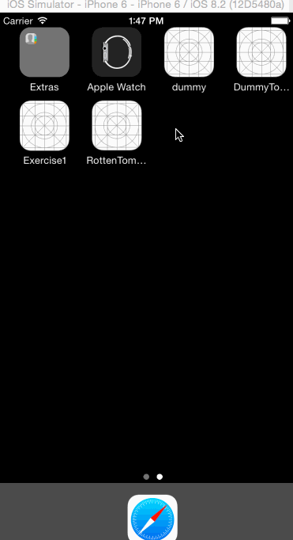

# RottenTomatoes Box Office Demo

This is a Swift demo application for displaying the latest box office movies using the [RottenTomatoes API](http://www.rottentomatoes.com/). 

Time spent: 10 hours spent in total

Completed user stories:

* [x] Required: User can view a list of latest box office movies ( image and title )
* [x] Required: User can click on a movie in the list to bring up a details page with additional information such as synopsis and ratings
* [x] Required: progress bar is shown while waiting for API to finish loading
* [x] Required: pull to refresh movie list
* [x] Required: network error is shown in the view not as a popup
* [x] Optional: Lo-res image is loaded first, then hi-res in the details view
* [x] Optional: custom selection effect is used ( blue text, default behavior turned off )

Notes:
I couldn't get the width of the storyboard layouts to scale up with the width of the simulator, I tried autolayout on and off to no avail

Walkthrough of all user stories:

GIF created with [LiceCap](http://www.cockos.com/licecap/).
